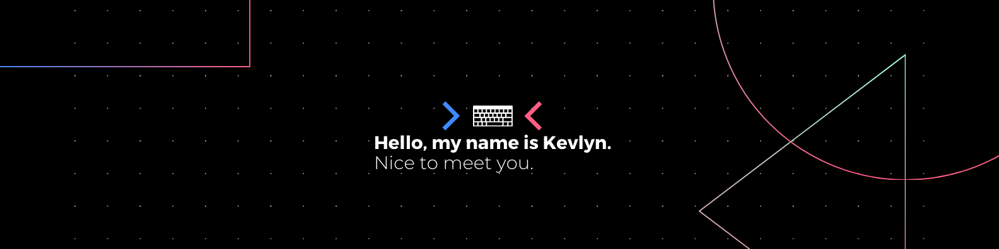

My name is Kevlyn Kadamala
-

- 🔭  I have a keen interest in Artificial Intelligence, Reinforcement Learning and Deep Learning
- ⚽️  I love football and I support Arsenal (COYG!)
- 🎧  I like listening to alternative music
- 👨‍🏫 I like discussing and sharing knowledge 😄
- 🤔  I'd like to get some help with training optimizations and model evaluations in Deep Learning
- 💬  You can ask me about football, AI or anything really!
- 📫  How to reach me:

[1]: https://twitter.com/kad99kev
[2]: https://www.linkedin.com/in/kevlyn-kadamala/
[3]: https://kad99kev.github.io

 [][1]
 [][2]
 [][3]

Here are some of the software tools and frameworks I'm familiar with :D

    

        
        

            
            
            
            
            
            
            
            
            
            
            
        

    

     
    

        
        

            
            
            
            
        

    

     
    

        
        
        
    

     
    

         
        
       
       
    

     
    

        
        
        
    

     
    

        
        
        
        
    

